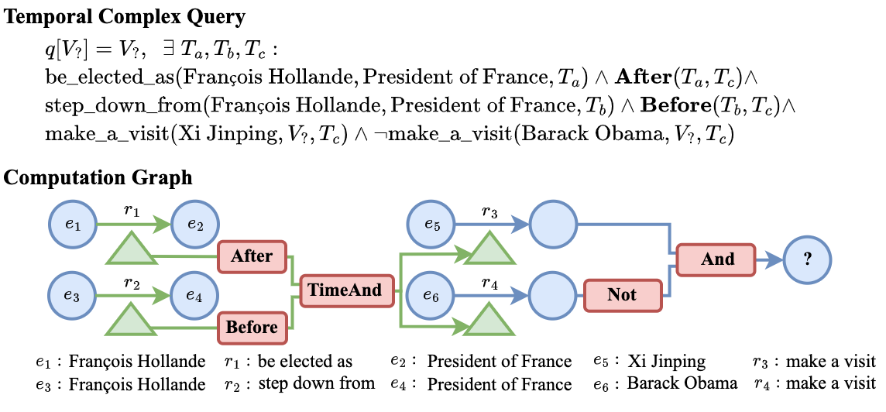

<div id="top"></div>

<div align="center">

# TFLEX: Temporal Feature-Logic Embedding Framework for Complex Reasoning over Temporal Knowledge Graph #

[](https://pytorch.org/get-started/locally/)


</div>

Code for "[TFLEX: Temporal Feature-Logic Embedding Framework for Complex Reasoning over Temporal Knowledge Graph](https://openreview.net/forum?id=oaGdsgB18L)" accepted to NeurIPS 2023.

[[OpenReview]](https://openreview.net/forum?id=oaGdsgB18L) [[arXiv]](https://arxiv.org/abs/2205.14307) [[Dataset: Google Drive]](https://drive.google.com/drive/folders/1ddkJoUBKxgonD8rYTIL_Tb3Pei_Mtvdb?usp=sharing)

Multi-hop logical reasoning over knowledge graph (KG) plays a fundamental role in many artificial intelligence tasks. Recent complex query embedding (CQE) methods for reasoning focus on static KGs, while temporal knowledge graphs (TKGs) have not been fully explored. Reasoning over TKGs has two challenges: 1. The query should answer entities or timestamps; 2. The operators should consider both set logic on entity set and temporal logic on timestamp set. To bridge this gap, we define the multi-hop logical reasoning problem on TKGs. With generated three datasets, we propose the first temporal CQE named Temporal Feature-Logic Embedding framework (TFLEX) to answer the temporal complex queries. We utilize vector logic to compute the logic part of Temporal Feature-Logic embeddings, thus naturally modeling all First-Order Logic (FOL) operations on entity set. In addition, our framework extends vector logic on timestamp set to cope with three extra temporal operators (After, Before and Between). Experiments on numerous query patterns demonstrate the effectiveness of our method.

Below is a typical multi-hop temporal complex query and its computation graph: "During François Hollande was the president of France, which countries did Xi Jinping visit but Barack Obama did not visit?". In the computation graph, there are entity set (blue circle), timestamp set (green triangle), time set projection (green arrow), entity set projection (blue arrow) and logical operators (red rectangle).



## 🔔 News

- **`Oct. 15, 2023`: Accepted to NeurIPS 2023! We have released the datasets of TFLEX in [Google Drive](https://drive.google.com/drive/folders/1ddkJoUBKxgonD8rYTIL_Tb3Pei_Mtvdb?usp=sharing).**


## 🌍 Contents

- [1. Install](#-1-install)
- [2. Get Started](#-2-get-started)
- [3. Results](#-3-results)
- [4. Visualization](#-4-visualization)
- [5. Interpreter](#-5-interpreter)
- [6. Dataset](#-6-dataset)

### 🔬 1. Install

- Python (>= 3.7)
- [PyTorch](http://pytorch.org/) (>= 1.8.0)
- numpy (>= 1.19.2)

```sh
pip install -r requirements.txt
cd assistence
pip install -e .
cd ..
```

### 🚀 2. Get Started

❗NOTE: Download the datasets in [Google Drive](https://drive.google.com/drive/folders/1ddkJoUBKxgonD8rYTIL_Tb3Pei_Mtvdb?usp=sharing) (~5G) and place in `data` folder.

```
./data
  - ICEWS14
    - cache
      - cache_xxx.pkl
      - cache_xxx.pkl
    - train
    - test
    - valid
  - ICEWS05-15
    - cache
      - cache_xxx.pkl
      - cache_xxx.pkl
    - train
    - test
    - valid
  - GDELT
    - cache
      - cache_xxx.pkl
      - cache_xxx.pkl
    - train
    - test
    - valid
```
Then run the command to train TFLEX on ICEWS14:

```sh
$ python train_TCQE_TFLEX.py --name="TFLEX_dim800_gamma15" --hidden_dim=800 --test_batch_size=32 --every_test_step=10000 --dataset="ICEWS14" --data_home="./data"

$ python train_TCQE_TFLEX.py --help
Usage: train_TCQE_TFLEX.py [OPTIONS]

Options:
  --data_home TEXT                The folder path to dataset.
  --dataset TEXT                  Which dataset to use: ICEWS14, ICEWS05_15,
                                  GDELT.
  --name TEXT                     Name of the experiment.
  --start_step INTEGER            start step.
  --max_steps INTEGER             Number of steps.
  --every_test_step INTEGER       test every k steps
  --every_valid_step INTEGER      validation every k steps.
  --batch_size INTEGER            Batch size.
  --test_batch_size INTEGER       Test batch size. Scoring to all is memory
                                  consuming. We need small test batch size.
  --negative_sample_size INTEGER  negative entities sampled per query
  --train_device TEXT             choice: cuda:0, cuda:1, cpu.
  --test_device TEXT              choice: cuda:0, cuda:1, cpu.
  --resume BOOLEAN                Resume from output directory.
  --resume_by_score FLOAT         Resume by score from output directory.
                                  Resume best if it is 0. Default: 0
  --lr FLOAT                      Learning rate.
  --cpu_num INTEGER               used to speed up torch.dataloader
  --hidden_dim INTEGER            embedding dimension
  --input_dropout FLOAT           Input layer dropout.
  --gamma FLOAT                   margin in the loss
  --center_reg FLOAT              center_reg for ConE, center_reg balances the
                                  in_cone dist and out_cone dist
  --train_tasks TEXT              the tasks for training
  --train_all BOOLEAN             if training all, it will use all tasks in
                                  data.train_queries_answers
  --eval_tasks TEXT               the tasks for evaluation
  --eval_all BOOLEAN              if evaluating all, it will use all tasks in
                                  data.test_queries_answers
  --help                          Show this message and exit.
```


<details>
  <summary>👈 🔎 Full commands for reproducing all results in the paper</summary>


```shell
# ICEWS14
CUDA_VISIBLE_DEVICES=0 python train_TCQE_TFLEX.py --name="TFLEX_dim800_gamma15" --hidden_dim=800 --test_batch_size=32 --every_test_step=10000 --dataset="ICEWS14"
CUDA_VISIBLE_DEVICES=0 python train_TCQE_X+ConE.py --name="X+ConE_dim800_gamma15" --hidden_dim=800 --test_batch_size=32 --every_test_step=10000 --dataset="ICEWS14"
CUDA_VISIBLE_DEVICES=0 python train_TCQE_X-1F.py --name="X-1F_dim800_gamma15" --hidden_dim=800 --test_batch_size=32 --every_test_step=10000 --dataset="ICEWS14"
CUDA_VISIBLE_DEVICES=0 python train_TCQE_X_without_entity_logic.py --name="X_without_entity_logic_dim800_gamma15" --hidden_dim=800 --test_batch_size=32 --every_test_step=10000 --dataset="ICEWS14"
CUDA_VISIBLE_DEVICES=0 python train_TCQE_X_without_time_logic.py --name="X_without_time_logic_dim800_gamma15" --hidden_dim=800 --test_batch_size=32 --every_test_step=10000 --dataset="ICEWS14"
CUDA_VISIBLE_DEVICES=0 python train_TCQE_X_without_logic.py --name="X_without_logic_dim800_gamma15" --hidden_dim=800 --test_batch_size=32 --every_test_step=10000 --dataset="ICEWS14"
CUDA_VISIBLE_DEVICES=0 python train_TCQE_Query2box.py --name="Query2box_dim800_gamma15" --hidden_dim=800 --test_batch_size=32 --every_test_step=10000 --dataset="ICEWS14"
CUDA_VISIBLE_DEVICES=0 python train_TCQE_BetaE.py --name="BetaE_dim800_gamma15" --hidden_dim=800 --test_batch_size=32 --every_test_step=10000 --dataset="ICEWS14"
CUDA_VISIBLE_DEVICES=0 python train_TCQE_ConE.py --name="ConE_dim800_gamma15" --hidden_dim=800 --test_batch_size=32 --every_test_step=10000 --dataset="ICEWS14"

CUDA_VISIBLE_DEVICES=0 python train_TCQE_Query2box.py --name="Query2box_dim800_gamma15" --hidden_dim=800 --test_batch_size=32 --every_test_step=10000 --dataset="ICEWS14" --resume=True --eval_tasks="Pe,Pe2,Pe3,e2i,e3i"
CUDA_VISIBLE_DEVICES=0 python train_TCQE_BetaE.py --name="BetaE_dim800_gamma15" --hidden_dim=800 --test_batch_size=32 --every_test_step=10000 --dataset="ICEWS14" --resume=True --eval_tasks="Pe,Pe2,Pe3,e2i,e3i,e2i_N,e3i_N,Pe_e2i_Pe_NPe,e2i_PeN,e2i_NPe,e2u,Pe_e2u"
CUDA_VISIBLE_DEVICES=0 python train_TCQE_ConE.py --name="ConE_dim800_gamma15" --hidden_dim=800 --test_batch_size=16 --every_test_step=10000 --dataset="ICEWS14" --resume=True --eval_tasks="Pe,Pe2,Pe3,e2i,e3i,e2i_N,e3i_N,Pe_e2i_Pe_NPe,e2i_PeN,e2i_NPe,e2u,Pe_e2u"

# ICEWS05-15
CUDA_VISIBLE_DEVICES=0 python train_TCQE_TFLEX.py --name="TFLEX_dim800_gamma15" --hidden_dim=800 --test_batch_size=16 --every_test_step=10000 --dataset="ICEWS05_15"
CUDA_VISIBLE_DEVICES=0 python train_TCQE_X+ConE.py --name="X+ConE_dim800_gamma15" --hidden_dim=800 --test_batch_size=16 --every_test_step=10000 --dataset="ICEWS05_15"
CUDA_VISIBLE_DEVICES=0 python train_TCQE_X-1F.py --name="X-1F_dim800_gamma15" --hidden_dim=800 --test_batch_size=16 --every_test_step=10000 --dataset="ICEWS05_15"
CUDA_VISIBLE_DEVICES=0 python train_TCQE_X_without_entity_logic.py --name="X_without_entity_logic_dim800_gamma15" --hidden_dim=800 --test_batch_size=16 --every_test_step=10000 --dataset="ICEWS05_15"
CUDA_VISIBLE_DEVICES=0 python train_TCQE_X_without_time_logic.py --name="X_without_time_logic_dim800_gamma15" --hidden_dim=800 --test_batch_size=16 --every_test_step=10000 --dataset="ICEWS05_15"
CUDA_VISIBLE_DEVICES=0 python train_TCQE_X_without_logic.py --name="X_without_logic_dim800_gamma15" --hidden_dim=800 --test_batch_size=16 --every_test_step=10000 --dataset="ICEWS05_15"
CUDA_VISIBLE_DEVICES=0 python train_TCQE_Query2box.py --name="Query2box_dim800_gamma15" --hidden_dim=800 --test_batch_size=16 --every_test_step=10000 --dataset="ICEWS05_15"
CUDA_VISIBLE_DEVICES=0 python train_TCQE_BetaE.py --name="BetaE_dim800_gamma15" --hidden_dim=800 --test_batch_size=16 --every_test_step=10000 --dataset="ICEWS05_15"
CUDA_VISIBLE_DEVICES=0 python train_TCQE_ConE.py --name="ConE_dim800_gamma15" --hidden_dim=800 --test_batch_size=16 --every_test_step=10000 --dataset="ICEWS05_15"

# GDELT
CUDA_VISIBLE_DEVICES=0 python train_TCQE_TFLEX.py --name="TFLEX_dim800_gamma15" --hidden_dim=800 --test_batch_size=64 --every_test_step=100000 --dataset="GDELT"
CUDA_VISIBLE_DEVICES=0 python train_TCQE_X+ConE.py --name="X+ConE_dim800_gamma15" --hidden_dim=800 --test_batch_size=64 --every_test_step=100000 --dataset="GDELT"
CUDA_VISIBLE_DEVICES=0 python train_TCQE_X-1F.py --name="X-1F_dim800_gamma15" --hidden_dim=800 --test_batch_size=64 --every_test_step=100000 --dataset="GDELT"
CUDA_VISIBLE_DEVICES=0 python train_TCQE_X_without_entity_logic.py --name="X_without_entity_logic_dim800_gamma15" --hidden_dim=800 --test_batch_size=64 --every_test_step=100000 --dataset="GDELT"
CUDA_VISIBLE_DEVICES=0 python train_TCQE_X_without_time_logic.py --name="X_without_time_logic_dim800_gamma15" --hidden_dim=800 --test_batch_size=64 --every_test_step=100000 --dataset="GDELT"
CUDA_VISIBLE_DEVICES=0 python train_TCQE_X_without_logic.py --name="X_without_logic_dim800_gamma15" --hidden_dim=800 --test_batch_size=64 --every_test_step=100000 --dataset="GDELT"
CUDA_VISIBLE_DEVICES=0 python train_TCQE_Query2box.py --name="Query2box_dim800_gamma15" --hidden_dim=800 --test_batch_size=64 --every_test_step=100000 --dataset="GDELT"
CUDA_VISIBLE_DEVICES=0 python train_TCQE_BetaE.py --name="BetaE_dim800_gamma15" --hidden_dim=800 --test_batch_size=64 --every_test_step=100000 --dataset="GDELT"
CUDA_VISIBLE_DEVICES=0 python train_TCQE_ConE.py --name="ConE_dim800_gamma15" --hidden_dim=800 --test_batch_size=64 --every_test_step=100000 --dataset="GDELT"
```

</details>

<br/>

### 🎯 3. Results

<details open>
  <summary>👈 🔎 Reported results</summary>


</details>

To support your research, we also open source some of our LaTeX files. Full LaTeX files can be found in [arXiv](https://arxiv.org/abs/2205.14307).

- [Table 1: Main Results](./assets/table1_main_results.tex)
- [Table 2: Full Detail Results](./assets/table2_full_results.tex)
- [Table 3: TKGC Results](./assets/table3_TKGC.tex)

### 🔬 4. Visualization

Please refer to `notebook/Draw.ipynb` to visualize the inference process of temporal complex queries.


### 🤖 5. Interpreter

To launch an interactive interpreter, please run `python run_reasoning_interpreter.py`


```python
use_dataset(data_home="/data/TFLEX/data"); use_embedding_reasoning_interpreter("TFLEX_dim800_gamma15", device="cuda:1");
sample(task_name="e2i", k=1);
emb_e1=entity_token(); emb_r1=relation_token(); emb_t1=timestamp_token();
emb_e2=entity_token(); emb_r2=relation_token(); emb_t2=timestamp_token();
emb_q1 = Pe(emb_e1, emb_r1, emb_t1)
emb_q2 = Pe(emb_e2, emb_r2, emb_t2)
emb_q = And(emb_q1, emb_q2)
embedding_answer_entities(emb_q, topk=3)
use_groundtruth_reasoning_interpreter()
groundtruth_answer()
OK. The bot correctly predict the hard answer which only exists in the test set!
```

### 📚 6. Dataset

<details>
  <summary>👈 🔎 Data directory structure</summary>

```
./data
  - ICEWS14
    - cache
      - cache_xxx.pkl
      - cache_xxx.pkl
    - train
    - test
    - valid
  - ICEWS05-15
    - cache
      - cache_xxx.pkl
      - cache_xxx.pkl
    - train
    - test
    - valid
  - GDELT
    - cache
      - cache_xxx.pkl
      - cache_xxx.pkl
    - train
    - test
    - valid
```

</details>

<details>
  <summary>👈 🔎 Dataset statistics: queries_count</summary>

| query | ICEWS14|     |       | ICEWS05_15|   |      | GDELT |       |      |
| :---- | :---- | :---- | :--- | :---- | :---- | :--- | :---- | :---- | :--- |
|  | train | valid | test | train | valid | test | train | valid | test |
| Pe | 66783 | 8837 | 8848 | 344042 | 45829 | 45644 | 1115102 | 273842 | 273432 |
| Pe2 | 72826 | 3482 | 4037 | 368962 | 10000 | 10000 | 2215309 | 10000 | 10000 |
| Pe3 | 72826 | 3492 | 4083 | 368962 | 10000 | 10000 | 2215309 | 10000 | 10000 |
| e2i | 72826 | 3305 | 3655 | 368962 | 10000 | 10000 | 2215309 | 10000 | 10000 |
| e3i | 72826 | 2966 | 3023 | 368962 | 10000 | 10000 | 2215309 | 10000 | 10000 |
| Pt | 42690 | 7331 | 7419 | 142771 | 28795 | 28752 | 687326 | 199780 | 199419 |
| aPt | 13234 | 4411 | 4411 | 68262 | 10000 | 10000 | 221530 | 10000 | 10000 |
| bPt | 13234 | 4411 | 4411 | 68262 | 10000 | 10000 | 221530 | 10000 | 10000 |
| Pe_Pt | 7282 | 3385 | 3638 | 36896 | 10000 | 10000 | 221530 | 10000 | 10000 |
| Pt_sPe_Pt | 13234 | 5541 | 6293 | 68262 | 10000 | 10000 | 221530 | 10000 | 10000 |
| Pt_oPe_Pt | 13234 | 5480 | 6242 | 68262 | 10000 | 10000 | 221530 | 10000 | 10000 |
| t2i | 72826 | 5112 | 6631 | 368962 | 10000 | 10000 | 2215309 | 10000 | 10000 |
| t3i | 72826 | 3094 | 3296 | 368962 | 10000 | 10000 | 2215309 | 10000 | 10000 |
| e2i_N | 7282 | 2949 | 2975 | 36896 | 10000 | 10000 | 221530 | 10000 | 10000 |
| e3i_N | 7282 | 2913 | 2914 | 36896 | 10000 | 10000 | 221530 | 10000 | 10000 |
| Pe_e2i_Pe_NPe | 7282 | 2968 | 3012 | 36896 | 10000 | 10000 | 221530 | 10000 | 10000 |
| e2i_PeN | 7282 | 2971 | 3031 | 36896 | 10000 | 10000 | 221530 | 10000 | 10000 |
| e2i_NPe | 7282 | 3061 | 3192 | 36896 | 10000 | 10000 | 221530 | 10000 | 10000 |
| t2i_N | 7282 | 3135 | 3328 | 36896 | 10000 | 10000 | 221530 | 10000 | 10000 |
| t3i_N | 7282 | 2924 | 2944 | 36896 | 10000 | 10000 | 221530 | 10000 | 10000 |
| Pe_t2i_PtPe_NPt | 7282 | 3031 | 3127 | 36896 | 10000 | 10000 | 221530 | 10000 | 10000 |
| t2i_PtN | 7282 | 3300 | 3609 | 36896 | 10000 | 10000 | 221530 | 10000 | 10000 |
| t2i_NPt | 7282 | 4873 | 5464 | 36896 | 10000 | 10000 | 221530 | 10000 | 10000 |
| e2u | - | 2913 | 2913 | - | 10000 | 10000 | - | 10000 | 10000 |
| Pe_e2u | - | 2913 | 2913 | - | 10000 | 10000 | - | 10000 | 10000 |
| t2u | - | 2913 | 2913 | - | 10000 | 10000 | - | 10000 | 10000 |
| Pe_t2u | - | 2913 | 2913 | - | 10000 | 10000 | - | 10000 | 10000 |
| t2i_Pe | - | 2913 | 2913 | - | 10000 | 10000 | - | 10000 | 10000 |
| Pe_t2i | - | 2913 | 2913 | - | 10000 | 10000 | - | 10000 | 10000 |
| e2i_Pe | - | 2913 | 2913 | - | 10000 | 10000 | - | 10000 | 10000 |
| Pe_e2i | - | 2913 | 2913 | - | 10000 | 10000 | - | 10000 | 10000 |
| between | 7282 | 2913 | 2913 | 36896 | 10000 | 10000 | 221530 | 10000 | 10000 |
| Pe_aPt | 7282 | 4134 | 4733 | 68262 | 10000 | 10000 | 221530 | 10000 | 10000 |
| Pe_bPt | 7282 | 3970 | 4565 | 36896 | 10000 | 10000 | 221530 | 10000 | 10000 |
| Pt_sPe | 7282 | 4976 | 5608 | 36896 | 10000 | 10000 | 221530 | 10000 | 10000 |
| Pt_oPe | 7282 | 3321 | 3621 | 36896 | 10000 | 10000 | 221530 | 10000 | 10000 |
| Pt_se2i | 7282 | 3226 | 3466 | 36896 | 10000 | 10000 | 221530 | 10000 | 10000 |
| Pt_oe2i | 7282 | 3236 | 3485 | 36896 | 10000 | 10000 | 221530 | 10000 | 10000 |
| Pe_at2i | 7282 | 4607 | 5338 | 36896 | 10000 | 10000 | 221530 | 10000 | 10000 |
| Pe_bt2i | 7282 | 4583 | 5386 | 36896 | 10000 | 10000 | 221530 | 10000 | 10000 |
</details>

<details>
  <summary>👈 🔎 Dataset statistics: avg_answers_count</summary>

| query | ICEWS14|     |       | ICEWS05_15|   |      | GDELT |       |      |
| :---- | :---- | :---- | :--- | :---- | :---- | :--- | :---- | :---- | :--- |
|  | train | valid | test | train | valid | test | train | valid | test |
|Pe | 1.09 | 1.01 | 1.01 | 1.07 | 1.01 | 1.01 | 2.07 | 1.21 | 1.21|
|Pe2 | 1.03 | 2.19 | 2.23 | 1.02 | 2.15 | 2.19 | 2.61 | 6.51 | 6.13|
|Pe3 | 1.04 | 2.25 | 2.29 | 1.02 | 2.18 | 2.21 | 5.11 | 10.86 | 10.70|
|e2i | 1.02 | 2.76 | 2.84 | 1.01 | 2.36 | 2.52 | 1.05 | 2.30 | 2.32|
|e3i | 1.00 | 1.57 | 1.59 | 1.00 | 1.26 | 1.26 | 1.00 | 1.20 | 1.35|
|Pt | 1.71 | 1.22 | 1.21 | 2.58 | 1.61 | 1.60 | 3.36 | 1.66 | 1.66|
|aPt | 177.99 | 176.09 | 175.89 | 2022.16 | 2003.85 | 1998.71 | 156.48 | 155.38 | 153.41|
|bPt | 181.20 | 179.88 | 179.26 | 1929.98 | 1923.75 | 1919.83 | 160.38 | 159.29 | 157.42|
|Pe_Pt | 1.58 | 7.90 | 8.62 | 2.84 | 18.11 | 20.63 | 26.56 | 42.54 | 41.33|
|Pt_sPe_Pt | 1.79 | 7.26 | 7.47 | 2.49 | 13.51 | 10.86 | 4.92 | 14.13 | 12.80|
|Pt_oPe_Pt | 1.75 | 7.27 | 7.48 | 2.55 | 13.01 | 14.34 | 4.62 | 14.47 | 12.90|
|t2i | 1.19 | 6.29 | 6.38 | 3.07 | 29.45 | 25.61 | 1.97 | 8.98 | 7.76|
|t3i | 1.01 | 2.88 | 3.14 | 1.08 | 10.03 | 10.22 | 1.06 | 3.79 | 3.52|
|e2i_N | 1.02 | 2.10 | 2.14 | 1.01 | 2.05 | 2.08 | 2.04 | 4.66 | 4.58|
|e3i_N | 1.00 | 1.00 | 1.00 | 1.00 | 1.00 | 1.00 | 1.02 | 1.19 | 1.37|
|Pe_e2i_Pe_NPe | 1.04 | 2.21 | 2.25 | 1.02 | 2.16 | 2.19 | 3.67 | 8.54 | 8.12|
|e2i_PeN | 1.04 | 2.22 | 2.26 | 1.02 | 2.17 | 2.21 | 3.67 | 8.66 | 8.36|
|e2i_NPe | 1.18 | 3.03 | 3.11 | 1.12 | 2.87 | 2.99 | 4.00 | 8.15 | 7.81|
|t2i_N | 1.15 | 3.31 | 3.44 | 1.21 | 4.06 | 4.20 | 2.91 | 8.78 | 7.56|
|t3i_N | 1.00 | 1.02 | 1.03 | 1.01 | 1.02 | 1.02 | 1.15 | 3.19 | 3.20|
|Pe_t2i_PtPe_NPt | 1.08 | 2.59 | 2.70 | 1.08 | 2.47 | 2.62 | 4.10 | 12.02 | 11.37|
|t2i_PtN | 1.41 | 5.22 | 5.47 | 1.70 | 8.10 | 8.11 | 4.56 | 12.56 | 11.32|
|t2i_NPt | 8.14 | 25.96 | 26.23 | 66.99 | 154.01 | 147.34 | 17.58 | 35.60 | 32.22|
|e2u | 0.00 | 3.12 | 3.17 | 0.00 | 2.38 | 2.40 | 0.00 | 5.04 | 5.41|
|Pe_e2u | 0.00 | 2.38 | 2.44 | 0.00 | 1.24 | 1.25 | 0.00 | 9.39 | 10.78|
|t2u | 0.00 | 4.35 | 4.53 | 0.00 | 5.57 | 5.92 | 0.00 | 9.70 | 10.51|
|Pe_t2u | 0.00 | 2.72 | 2.83 | 0.00 | 1.24 | 1.28 | 0.00 | 9.90 | 11.27|
|t2i_Pe | 0.00 | 1.03 | 1.03 | 0.00 | 1.01 | 1.02 | 0.00 | 1.34 | 1.44|
|Pe_t2i | 0.00 | 1.14 | 1.16 | 0.00 | 1.07 | 1.08 | 0.00 | 2.01 | 2.20|
|e2i_Pe | 0.00 | 1.00 | 1.00 | 0.00 | 1.00 | 1.00 | 0.00 | 1.07 | 1.10|
|Pe_e2i | 0.00 | 2.18 | 2.24 | 0.00 | 1.32 | 1.33 | 0.00 | 5.08 | 5.49|
|between | 122.61 | 120.94 | 120.27 | 1407.87 | 1410.39 | 1404.76 | 214.16 | 210.99 | 207.85|
|Pe_aPt | 4.67 | 16.73 | 16.50 | 18.68 | 43.80 | 46.23 | 49.31 | 66.21 | 68.88|
|Pe_bPt | 4.53 | 17.07 | 16.80 | 18.70 | 45.81 | 48.23 | 67.67 | 84.79 | 83.00|
|Pt_sPe | 8.65 | 28.86 | 29.22 | 71.51 | 162.36 | 155.46 | 27.55 | 45.83 | 43.73|
|Pt_oPe | 1.41 | 5.23 | 5.46 | 1.68 | 8.36 | 8.21 | 3.84 | 11.31 | 10.06|
|Pt_se2i | 1.31 | 5.72 | 6.19 | 1.37 | 9.00 | 9.30 | 2.76 | 8.72 | 7.66|
|Pt_oe2i | 1.32 | 6.51 | 7.00 | 1.44 | 10.49 | 10.89 | 2.55 | 8.17 | 7.27|
|Pe_at2i | 7.26 | 22.63 | 21.98 | 30.40 | 60.03 | 53.18 | 88.77 | 101.60 | 101.88|
|Pe_bt2i | 7.27 | 21.92 | 21.23 | 30.31 | 61.59 | 64.98 | 88.80 | 100.64 | 100.67|
</details>

<br/>

**📚 Explore the dataset**

To speed up the training, we have preprocessed the dataset and cached the data in `./data/{dataset_name}/cache/`.
And we aim to provide a unified, human-friendly interface to access the dataset.
That is, we need to annotate the type of each data object in the dataset and allow to access as attribution.
The type annotation is friendly to IDE and can help us to avoid some bugs, otherwise, we won't know the type of object before loading it.

To inspect the dataset in jupyter notebook, we can use the following code:
```py
from ComplexTemporalQueryData import ICEWS14, ICEWS05_15, GDELT
from ComplexTemporalQueryData import ComplexTemporalQueryDatasetCachePath, TemporalComplexQueryData

data_home = "./data"
if dataset_name == "ICEWS14":
    dataset = ICEWS14(data_home)
elif dataset_name == "ICEWS05_15":
    dataset = ICEWS05_15(data_home)
elif dataset_name == "GDELT":
    dataset = GDELT(data_home)
cache = ComplexTemporalQueryDatasetCachePath(dataset.cache_path)
data = TemporalComplexQueryData(dataset, cache_path=cache)
data.preprocess_data_if_needed()
data.load_cache([
    "meta",
    "all_timestamps",  # -> ./data/{dataset_name}/cache/all_timestamps.pkl
    "idx2entity",
    "test_queries_answers",
])
print(data.entity_count)  # with "meta" loaded
print(data.all_timestamps)  # directly access as attribution with cache "all_timestamps" loaded
print(data.test_queries_answers)  # all cache can be found in dir "./data/{dataset_name}/cache", specific in class ComplexTemporalQueryDatasetCachePath
```

<details>
  <summary>👈 🔎 Available attribution and cache</summary>

```py
# (s, r, o, t)
self.all_triples: List[Tuple[str, str, str, str]]
self.train_triples: List[Tuple[str, str, str, str]]
self.test_triples: List[Tuple[str, str, str, str]]
self.valid_triples: List[Tuple[str, str, str, str]]

# (s, r, o, t)
self.all_triples_ids: List[Tuple[int, int, int, int]]
self.train_triples_ids: List[Tuple[int, int, int, int]]
self.test_triples_ids: List[Tuple[int, int, int, int]]
self.valid_triples_ids: List[Tuple[int, int, int, int]]

self.all_relations: List[str]  # name
self.all_entities: List[str]
self.all_timestamps: List[str]
self.entities_ids: List[int]  # id, starting from 0
self.relations_ids: List[int]  # origin in [0, relation_count), reversed relation in [relation_count, 2*relation_count)
self.timestamps_ids: List[int]

self.entity2idx: Dict[str, int]
self.idx2entity: Dict[int, str]
self.relation2idx: Dict[str, int]
self.idx2relation: Dict[int, str]
self.timestamp2idx: Dict[str, int]
self.idx2timestamp: Dict[int, str]

# Dict[str, Dict[str, Union[List[str], List[Tuple[List[int], Set[int]]]]]]
#       |                       |                     |          |
#     structure name      args name list              |          |
#                                    ids corresponding to args   |
#                                                          answers id set
# 1. `structure name` is the name of a function (named query function), parsed to AST and eval to get results.
# 2. `args name list` is the arg list of query function.
# 3. train_queries_answers, valid_queries_answers and test_queries_answers are heavy to load (~10G+ memory)
#    we suggest to load by query task, e.g. load_cache_by_tasks(["Pe", "Pe2", "Pe3", "e2i", "e3i"], "train")
self.train_queries_answers: TYPE_train_queries_answers = {
    # "Pe_aPt": {
    #     "args": ["e1", "r1", "e2", "r2", "e3"],
    #     "queries_answers": [
    #         ([1, 2, 3, 4, 5], {2, 3, 5}),
    #         ([1, 2, 3, 4, 5], {2, 3, 5}),
    #         ([1, 2, 3, 4, 5], {2, 3, 5}),
    #     ]
    # }
    # >>> answers = Pe_aPt(1, 2, 3, 4, 5)
    # then, answers == {2, 3}
}
self.valid_queries_answers: TYPE_test_queries_answers = {
    # "Pe_aPt": {
    #     "args": ["e1", "r1", "e2", "r2", "e3"],
    #     "queries_answers": [
    #         ([1, 2, 3, 4, 5], {2, 3}, {2, 3, 5}),
    #         ([1, 2, 3, 4, 5], {2, 3}, {2, 3, 5}),
    #         ([1, 2, 3, 4, 5], {2, 3}, {2, 3, 5}),
    #     ]
    # }
    # >>> answers = Pe_aPt(1, 2, 3, 4, 5)
    # in training set, answers == {2, 3}
    # in validation set, answers == {2, 3, 5}, harder and more complete
}
self.test_queries_answers: TYPE_test_queries_answers = {
    # "Pe_aPt": {
    #     "args": ["e1", "r1", "e2", "r2", "e3"],
    #     "queries_answers": [
    #         ([1, 2, 3, 4, 5], {2, 3, 5}, {2, 3, 5, 6}),
    #         ([1, 2, 3, 4, 5], {2, 3, 5}, {2, 3, 5, 6}),
    #         ([1, 2, 3, 4, 5], {2, 3, 5}, {2, 3, 5, 6}),
    #     ]
    # }
    # >>> answers = Pe_aPt(1, 2, 3, 4, 5)
    # in training and validation set, answers == {2, 3}
    # in testing set, answers == {2, 3, 5}, harder and more complete
}

# meta info
# `load_cache(["meta"])` will load below all.
self.query_meta = {
    # "Pe_aPt": {
    #     "queries_count": 1,
    #     "avg_answers_count": 1
    # }
}
self.entity_count: int
self.relation_count: int
self.timestamp_count: int
self.valid_triples_count: int
self.test_triples_count: int
self.train_triples_count: int
self.triple_count: int
```

</details>

or we can load or save the cache using `pickle`, bypassing the `load_cache` method:
```py
import pickle

def cache_data(data, cache_path: Union[str, Path]):
    with open(str(cache_path), 'wb') as f:
        pickle.dump(data, f)


def read_cache(cache_path: Union[str, Path]):
    with open(str(cache_path), 'rb') as f:
        return pickle.load(f)

# or we can use
# from toolbox.data.functional import read_cache, cache_data
idx2entity = read_cache("./data/{dataset_name}/cache/idx2entity.pkl")
print(type(idx2entity))
cache_data(idx2entity, "./data/{dataset_name}/cache/idx2entity.pkl")
```

**📚 Customize your own TKG complex query dataset**

To implement other temporal knowledge graph complex query datasets, we need to provide initial data files and customize a dataset schema class:
```py
"""
./data
  - ICEWS14
    - cache
      - cache_xxx.pkl
      - cache_xxx.pkl
    - train
    - test
    - valid
"""
from toolbox.data.DatasetSchema import RelationalTripletDatasetSchema

class ICEWS14(RelationalTripletDatasetSchema):
    def __init__(self, home: Union[Path, str] = "data"):
        super(ICEWS14, self).__init__("ICEWS14", home)

    def get_data_paths(self) -> Dict[str, Path]:
        return {
            # provided initial data file
            # txt utf-8 format, ecah line is
            # "{subject_name}\t{relation_name}\t{object_name}\t{timestamp_name}\n"
            'train': self.get_dataset_path_child('train'),  # data/ICEWS14/train,
            'test': self.get_dataset_path_child('test'),  # data/ICEWS14/test
            'valid': self.get_dataset_path_child('valid'),  # data/ICEWS14/valid
        }

    def get_dataset_path(self):
        return self.root_path  # data root path = "data"

dataset = ICEWS14("./data")
print(dataset.root_path)  # data
print(dataset.dataset_path)  # data/ICEWS14, specific in get_dataset_path()
print(dataset.cache_path) # data/ICEWS14/cache

# then use it as is introduced above
cache = ComplexTemporalQueryDatasetCachePath(dataset.cache_path)
data = TemporalComplexQueryData(dataset, cache_path=cache)
...
```

To generate temporal complex queries (TCQs), we have a terminal user interface: `python run_sampling_TCQs.py`.
```shell
$ python run_sampling_TCQs.py --help
Usage: run_sampling_TCQs.py [OPTIONS]

Options:
  --data_home TEXT  The folder path to dataset.
  --dataset TEXT    Which dataset to use: ICEWS14, ICEWS05_15, GDELT.
  --help            Show this message and exit.

$ python run_sampling_TCQs.py --data_home data --dataset ICEWS14
preparing data
entities_ids 7128
relations_ids 230
timestamps_ids 365
Pe train 66783 valid 8837 test 8848
Pt train 42690 valid 7331 test 7419
...
```

To show the meta of the generated dataset, run `python run_meta.py`.
```shell
$ python run_meta.py --help
Usage: run_meta.py [OPTIONS]

Options:
  --data_home TEXT  The folder path to dataset.
  --help            Show this message and exit.
```

## 🤝 Citation

Please condiser citing this paper if you use the ```code``` or ```data``` from our work. Thanks a lot :)

(`Xueyuan et al., 2023` preferred, instead of `Lin et al., 2023`)

```bibtex
@inproceedings{
  xueyuan2023tflex,
  title={{TFLEX}: Temporal Feature-Logic Embedding Framework for Complex Reasoning over Temporal Knowledge Graph},
  author={Lin Xueyuan and Haihong E and Chengjin Xu and Gengxian Zhou and Haoran Luo and Tianyi Hu and Fenglong Su and Ningyuan Li and Mingzhi Sun},
  booktitle={Thirty-seventh Conference on Neural Information Processing Systems},
  year={2023},
  url={https://openreview.net/forum?id=oaGdsgB18L}
}
```

---

TFLEX is released under the [Apache License 2.0](https://www.apache.org/licenses/LICENSE-2.0) license.

<p align="right">(<a href="#top">back to top</a>)</p>
