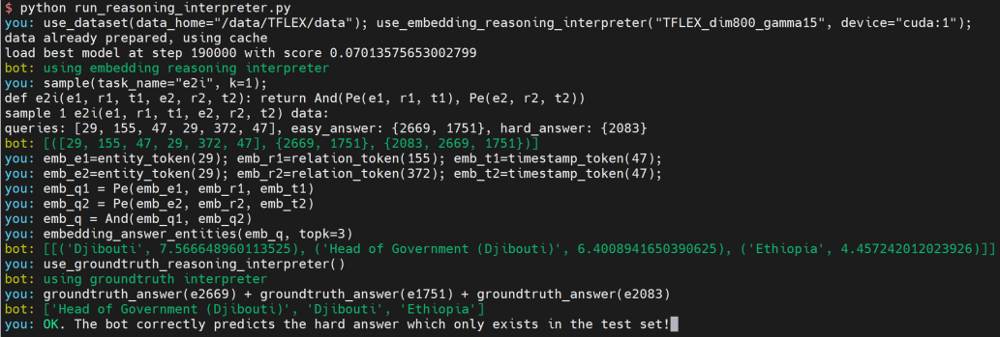

# TFLEX

code for "TFLEX: Temporal Feature-Logic Embedding Framework for Complex Reasoning over Temporal Knowledge Graph"


## News

- Aug. 8, 2023: We plan to release the generated datasets when the paper is accepted. Now the datasets are under review. From the reviews, we find that the reviewers are also interested in other generated datasets, like reshaping the static complex query datasets (FB237, FB15k, NELL) to temporal ones. These datasets are still in progress.

## Environment

- PyTorch 1.8.1 + cuda 10.2

```sh
pip install -r requirements.txt
cd assistence
pip install -e .
cd ..
```

## Get Started

```shell
# ICEWS14
CUDA_VISIBLE_DEVICES=0 python train_TCQE_TFLEX.py --name="TFLEX_dim800_gamma15" --hidden_dim=800 --test_batch_size=32 --every_test_step=10000 --dataset="ICEWS14"
CUDA_VISIBLE_DEVICES=0 python train_TCQE_X+ConE.py --name="X+ConE_dim800_gamma15" --hidden_dim=800 --test_batch_size=32 --every_test_step=10000 --dataset="ICEWS14"
CUDA_VISIBLE_DEVICES=0 python train_TCQE_X-1F.py --name="X-1F_dim800_gamma15" --hidden_dim=800 --test_batch_size=32 --every_test_step=10000 --dataset="ICEWS14"
CUDA_VISIBLE_DEVICES=0 python train_TCQE_X_without_entity_logic.py --name="X_without_entity_logic_dim800_gamma15" --hidden_dim=800 --test_batch_size=32 --every_test_step=10000 --dataset="ICEWS14"
CUDA_VISIBLE_DEVICES=0 python train_TCQE_X_without_time_logic.py --name="X_without_time_logic_dim800_gamma15" --hidden_dim=800 --test_batch_size=32 --every_test_step=10000 --dataset="ICEWS14"
CUDA_VISIBLE_DEVICES=0 python train_TCQE_X_without_logic.py --name="X_without_logic_dim800_gamma15" --hidden_dim=800 --test_batch_size=32 --every_test_step=10000 --dataset="ICEWS14"
CUDA_VISIBLE_DEVICES=0 python train_TCQE_Query2box.py --name="Query2box_dim800_gamma15" --hidden_dim=800 --test_batch_size=32 --every_test_step=10000 --dataset="ICEWS14"
CUDA_VISIBLE_DEVICES=0 python train_TCQE_BetaE.py --name="BetaE_dim800_gamma15" --hidden_dim=800 --test_batch_size=32 --every_test_step=10000 --dataset="ICEWS14"
CUDA_VISIBLE_DEVICES=0 python train_TCQE_ConE.py --name="ConE_dim800_gamma15" --hidden_dim=800 --test_batch_size=32 --every_test_step=10000 --dataset="ICEWS14"

CUDA_VISIBLE_DEVICES=0 python train_TCQE_Query2box.py --name="Query2box_dim800_gamma15" --hidden_dim=800 --test_batch_size=32 --every_test_step=10000 --dataset="ICEWS14" --resume=True --eval_tasks="Pe,Pe2,Pe3,e2i,e3i"
CUDA_VISIBLE_DEVICES=0 python train_TCQE_BetaE.py --name="BetaE_dim800_gamma15" --hidden_dim=800 --test_batch_size=32 --every_test_step=10000 --dataset="ICEWS14" --resume=True --eval_tasks="Pe,Pe2,Pe3,e2i,e3i,e2i_N,e3i_N,Pe_e2i_Pe_NPe,e2i_PeN,e2i_NPe,e2u,Pe_e2u"
CUDA_VISIBLE_DEVICES=0 python train_TCQE_ConE.py --name="ConE_dim800_gamma15" --hidden_dim=800 --test_batch_size=16 --every_test_step=10000 --dataset="ICEWS14" --resume=True --eval_tasks="Pe,Pe2,Pe3,e2i,e3i,e2i_N,e3i_N,Pe_e2i_Pe_NPe,e2i_PeN,e2i_NPe,e2u,Pe_e2u"

# ICEWS05-15
CUDA_VISIBLE_DEVICES=0 python train_TCQE_TFLEX.py --name="TFLEX_dim800_gamma15" --hidden_dim=800 --test_batch_size=16 --every_test_step=10000 --dataset="ICEWS05_15"
CUDA_VISIBLE_DEVICES=0 python train_TCQE_X+ConE.py --name="X+ConE_dim800_gamma15" --hidden_dim=800 --test_batch_size=16 --every_test_step=10000 --dataset="ICEWS05_15"
CUDA_VISIBLE_DEVICES=0 python train_TCQE_X-1F.py --name="X-1F_dim800_gamma15" --hidden_dim=800 --test_batch_size=16 --every_test_step=10000 --dataset="ICEWS05_15"
CUDA_VISIBLE_DEVICES=0 python train_TCQE_X_without_entity_logic.py --name="X_without_entity_logic_dim800_gamma15" --hidden_dim=800 --test_batch_size=16 --every_test_step=10000 --dataset="ICEWS05_15"
CUDA_VISIBLE_DEVICES=0 python train_TCQE_X_without_time_logic.py --name="X_without_time_logic_dim800_gamma15" --hidden_dim=800 --test_batch_size=16 --every_test_step=10000 --dataset="ICEWS05_15"
CUDA_VISIBLE_DEVICES=0 python train_TCQE_X_without_logic.py --name="X_without_logic_dim800_gamma15" --hidden_dim=800 --test_batch_size=16 --every_test_step=10000 --dataset="ICEWS05_15"
CUDA_VISIBLE_DEVICES=0 python train_TCQE_Query2box.py --name="Query2box_dim800_gamma15" --hidden_dim=800 --test_batch_size=16 --every_test_step=10000 --dataset="ICEWS05_15"
CUDA_VISIBLE_DEVICES=0 python train_TCQE_BetaE.py --name="BetaE_dim800_gamma15" --hidden_dim=800 --test_batch_size=16 --every_test_step=10000 --dataset="ICEWS05_15"
CUDA_VISIBLE_DEVICES=0 python train_TCQE_ConE.py --name="ConE_dim800_gamma15" --hidden_dim=800 --test_batch_size=16 --every_test_step=10000 --dataset="ICEWS05_15"

# GDELT
CUDA_VISIBLE_DEVICES=0 python train_TCQE_TFLEX.py --name="TFLEX_dim800_gamma15" --hidden_dim=800 --test_batch_size=64 --every_test_step=100000 --dataset="GDELT"
CUDA_VISIBLE_DEVICES=0 python train_TCQE_X+ConE.py --name="X+ConE_dim800_gamma15" --hidden_dim=800 --test_batch_size=64 --every_test_step=100000 --dataset="GDELT"
CUDA_VISIBLE_DEVICES=0 python train_TCQE_X-1F.py --name="X-1F_dim800_gamma15" --hidden_dim=800 --test_batch_size=64 --every_test_step=100000 --dataset="GDELT"
CUDA_VISIBLE_DEVICES=0 python train_TCQE_X_without_entity_logic.py --name="X_without_entity_logic_dim800_gamma15" --hidden_dim=800 --test_batch_size=64 --every_test_step=100000 --dataset="GDELT"
CUDA_VISIBLE_DEVICES=0 python train_TCQE_X_without_time_logic.py --name="X_without_time_logic_dim800_gamma15" --hidden_dim=800 --test_batch_size=64 --every_test_step=100000 --dataset="GDELT"
CUDA_VISIBLE_DEVICES=0 python train_TCQE_X_without_logic.py --name="X_without_logic_dim800_gamma15" --hidden_dim=800 --test_batch_size=64 --every_test_step=100000 --dataset="GDELT"
CUDA_VISIBLE_DEVICES=0 python train_TCQE_Query2box.py --name="Query2box_dim800_gamma15" --hidden_dim=800 --test_batch_size=64 --every_test_step=100000 --dataset="GDELT"
CUDA_VISIBLE_DEVICES=0 python train_TCQE_BetaE.py --name="BetaE_dim800_gamma15" --hidden_dim=800 --test_batch_size=64 --every_test_step=100000 --dataset="GDELT"
CUDA_VISIBLE_DEVICES=0 python train_TCQE_ConE.py --name="ConE_dim800_gamma15" --hidden_dim=800 --test_batch_size=64 --every_test_step=100000 --dataset="GDELT"
```

## Dataset

To generate dataset, please run `python run_sampling_TCQs.py`.

To show the meta of the generated dataset, run `python run_meta.py`.

## Interpreter

To launch an interactive interpreter, please run `python run_reasoning_interpreter.py`



```python
use_dataset(data_home="/data/TFLEX/data"); use_embedding_reasoning_interpreter("TFLEX_dim800_gamma15", device="cuda:1");
sample(task_name="e2i", k=1);
emb_e1=entity_token(); emb_r1=relation_token(); emb_t1=timestamp_token();
emb_e2=entity_token(); emb_r2=relation_token(); emb_t2=timestamp_token();
emb_q1 = Pe(emb_e1, emb_r1, emb_t1)
emb_q2 = Pe(emb_e2, emb_r2, emb_t2)
emb_q = And(emb_q1, emb_q2)
embedding_answer_entities(emb_q, topk=3)
use_groundtruth_reasoning_interpreter()
groundtruth_answer()
OK. The bot correctly predict the hard answer which only exists in the test set!
```
